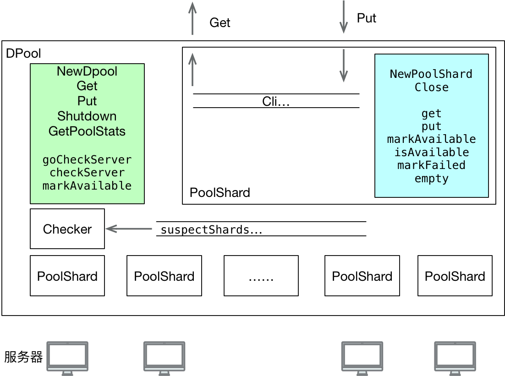

# 系统结构

# 逻辑理解

1、DPool对外暴露的接口有NewDPool( ), Get( ), Put( ), Shutdown( ), GetPoolStats( ). 功能分别是创建连接池，获取连接，归还连接，关闭连接池，获取连接池的状态。

2、Shard对Dpool暴露的接口有NewPoolShard( ), Close( ). 其他各函数均是在DPool的驱动下调用的。

3、Dpool的Get函数，也即获取连接的逻辑是：

- 采取轮询的机制来依次从Shard获取连接，有重试机制。Get会调用Shard的get( )函数。

shard的get函数：

- 检查closed是否为1，即关闭，若关闭，则直接返回。否则，
- 进入select语句，若连接channel里有空闲连接，则直接拿走，若无，
- 查看当前活跃连接是否小于最大值，若是则新建连接，更新当前活跃数，是否失败，shard等等。
- 否则，直接返回。

4、Dpool的Put函数，归还连接的逻辑是：

- 检查是否有数据源，若无，则直接关闭，否则，

- 通过borrowed字段查看是否是连接池的连接，若是，
- 根据归还时的broken字段更新一些字段的值，
- 尝试入chnnel，若失败，则直接关闭。

5、markFailed只在get和put的时候进行，closed在getStats和shutdown的时候进行。

6、empty函数关闭channel里的所有连接，只在标记失败和close的时候调用。

7、Dpool会每3秒触发一次健康检查，同时会对疑似失败的shard channel进行检查。一旦收到一次标记成功，则清空失败次数

8、摘除机制有健康比检查，不能把所有的节点都摘掉。

9、使用Dpool时，需要提供一个新建连接的工厂函数，实现create validate close函数，当服务只有一个vip时，validate函数返回nil(error)。

10、使用Dpool时，只用将Dpool封装一下就行，同时，提供PooledConnFactory的一个实现，PooledConnFactory主要是创建客户端，这个客户端结构体里要加上pooledObject。

# 代码学习

1、各种利用int32, int64的原子操作

2、shard思想，减少锁的粒度

3、PooledConnFactory、Poolable、PooledObject的实现

# 不足

1、PooledObject的borrowed没必要设锁。shard的时候也没必要加锁。

