# thrift介绍

# 源码分析

## processor

## protocol

## transport

## serversocket

## socket

## 其他

## 更底层

# Hack

## 白名单控制

## 负载均衡控制


——从idl中定义的一个服务是如何请求服务端以及如何得到返回结果谈起

我们采取由上到下的顺序，读完本文后亦可由下至上重新过一遍thrift源码，相信会有收获。

首先我们从idl中定义的一个服务看起。如GCS的一个坐标转格子的服务：

```golang
//批量通过坐标查id请求格式
enum CoordType {
    BAIDU = 1,
    SOSOGCJ = 2,
    WGS84 = 3,
}

struct RequestMeta {
    1: required string caller;
    2: required string traceId;
}

//坐标最小单元
struct CoordUnit {
    1: required double lng; //查询坐标经度
    2: required double lat; //查询坐标维度
}

struct Coord2GidReq {
    1: required list<CoordUnit> coordlist;      //坐标列表
    2: required CoordType coordtype;        //坐标系
    3: required i32 layer;                  //层数
}

//批量通过坐标查id响应格式
struct Coord2GidResp {
    1: required list<string> gidlist;         //格子id列表 
}

//通过坐标查Gid 单坐标单机10w qps，平响 0.7ms
Coord2GidResp Coord2Gid(1:RequestMeta meta, 2:Coord2GidReq req)
```

Coord2Gid上面是坐标转格子服务，Coord2GidReq请求参数中包含坐标列表，坐标系以及层数。返回结果是一个格子id的列表。涉及到的结构体有CoordUnit，RequestMeta，另外还涉及到一个枚举类型CoordType。CoordUnit表示一个坐标，包含经度、纬度；RequestMeta表示GCS对一个请求meta数据，包含caller, traceId；而CoordType则表示坐标系，滴滴国内目前使用的是腾讯的SOSO坐标系。

我们再看由编译器生成的golang源代码 ttypes.go:

关于枚举类型CoordType如下，将其定义成了一个int64类型的一组常量，并提供字符串到CoordType的转换函数。
```golang
type CoordType int64

const (
	CoordType_BAIDU   CoordType = 1
	CoordType_SOSOGCJ CoordType = 2
	CoordType_WGS84   CoordType = 3
)

func (p CoordType) String() string {
	switch p {
	case CoordType_BAIDU:
		return "CoordType_BAIDU"
	case CoordType_SOSOGCJ:
		return "CoordType_SOSOGCJ"
	case CoordType_WGS84:
		return "CoordType_WGS84"
	}
	return "<UNSET>"
}

func CoordTypeFromString(s string) (CoordType, error) {
	switch s {
	case "CoordType_BAIDU":
		return CoordType_BAIDU, nil
	case "CoordType_SOSOGCJ":
		return CoordType_SOSOGCJ, nil
	case "CoordType_WGS84":
		return CoordType_WGS84, nil
	}
	return CoordType(0), fmt.Errorf("not a valid CoordType string")
}

func CoordTypePtr(v CoordType) *CoordType { return &v }

```

关于RequestMeta如下，RequestMeta是Coord2Gid请求里的一个参数，因此涉及到将请求从客户端传输到服务端，以及从服务端读取客户端发送过来的请求。

具体来看下，从客户端到服务端需要用到的函数为Write函数，参数oprot thrift.TProtocol暂时可以先不看，它代表了协议的一层，暂时可以将其看成一个连接，通过它可以像服务端写数据。我们可以看到，写结构体的顺序是：


对于writeField，Field代表结构体里的一个字段，在本例中，Field1和Field2都代表的是一个string。我们来看看writeField1内部是如何实现的：

```golang
func (p *RequestMeta) writeField1(oprot thrift.TProtocol) (err error) {
	if err := oprot.WriteFieldBegin("caller", thrift.STRING, 1); err != nil {
		return fmt.Errorf("%T write field begin error 1:caller: %s", p, err)
	}
	if err := oprot.WriteString(string(p.Caller)); err != nil {
		return fmt.Errorf("%T.caller (1) field write error: %s", p, err)
	}
	if err := oprot.WriteFieldEnd(); err != nil {
		return fmt.Errorf("%T write field end error 1:caller: %s", p, err)
	}
	return err
}
```

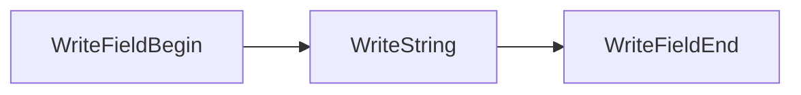
也是先写了一个Begin，然后开始写具体的字段，最后写了一个End。重点看一下
```golang
WriteFieldBegin("caller", thrift.STRING, 1)
```

这里的WriteFieldBegin的函数原型如下，写入了name, typeId, id，name即字段名，typeId即字段类型，id则代表了顺序。这个数字是由之前定义的idl文件决定的。
```golang
WriteFieldBegin(name string, typeId TType, id int16) error
```


```golang
type RequestMeta struct {
	Caller  string `thrift:"caller,1,required" json:"caller"`
	TraceId string `thrift:"traceId,2,required" json:"traceId"`
}

func NewRequestMeta() *RequestMeta {
	return &RequestMeta{}
}

func (p *RequestMeta) GetCaller() string {
	return p.Caller
}

func (p *RequestMeta) GetTraceId() string {
	return p.TraceId
}
func (p *RequestMeta) Read(iprot thrift.TProtocol) error {
	if _, err := iprot.ReadStructBegin(); err != nil {
		return fmt.Errorf("%T read error: %s", p, err)
	}
	for {
		_, fieldTypeId, fieldId, err := iprot.ReadFieldBegin()
		if err != nil {
			return fmt.Errorf("%T field %d read error: %s", p, fieldId, err)
		}
		if fieldTypeId == thrift.STOP {
			break
		}
		switch fieldId {
		case 1:
			if err := p.ReadField1(iprot); err != nil {
				return err
			}
		case 2:
			if err := p.ReadField2(iprot); err != nil {
				return err
			}
		default:
			if err := iprot.Skip(fieldTypeId); err != nil {
				return err
			}
		}
		if err := iprot.ReadFieldEnd(); err != nil {
			return err
		}
	}
	if err := iprot.ReadStructEnd(); err != nil {
		return fmt.Errorf("%T read struct end error: %s", p, err)
	}
	return nil
}

func (p *RequestMeta) ReadField1(iprot thrift.TProtocol) error {
	if v, err := iprot.ReadString(); err != nil {
		return fmt.Errorf("error reading field 1: %s", err)
	} else {
		p.Caller = v
	}
	return nil
}

func (p *RequestMeta) ReadField2(iprot thrift.TProtocol) error {
	if v, err := iprot.ReadString(); err != nil {
		return fmt.Errorf("error reading field 2: %s", err)
	} else {
		p.TraceId = v
	}
	return nil
}

func (p *RequestMeta) Write(oprot thrift.TProtocol) error {
	if err := oprot.WriteStructBegin("RequestMeta"); err != nil {
		return fmt.Errorf("%T write struct begin error: %s", p, err)
	}
	if err := p.writeField1(oprot); err != nil {
		return err
	}
	if err := p.writeField2(oprot); err != nil {
		return err
	}
	if err := oprot.WriteFieldStop(); err != nil {
		return fmt.Errorf("write field stop error: %s", err)
	}
	if err := oprot.WriteStructEnd(); err != nil {
		return fmt.Errorf("write struct stop error: %s", err)
	}
	return nil
}

func (p *RequestMeta) writeField1(oprot thrift.TProtocol) (err error) {
	if err := oprot.WriteFieldBegin("caller", thrift.STRING, 1); err != nil {
		return fmt.Errorf("%T write field begin error 1:caller: %s", p, err)
	}
	if err := oprot.WriteString(string(p.Caller)); err != nil {
		return fmt.Errorf("%T.caller (1) field write error: %s", p, err)
	}
	if err := oprot.WriteFieldEnd(); err != nil {
		return fmt.Errorf("%T write field end error 1:caller: %s", p, err)
	}
	return err
}

func (p *RequestMeta) writeField2(oprot thrift.TProtocol) (err error) {
	if err := oprot.WriteFieldBegin("traceId", thrift.STRING, 2); err != nil {
		return fmt.Errorf("%T write field begin error 2:traceId: %s", p, err)
	}
	if err := oprot.WriteString(string(p.TraceId)); err != nil {
		return fmt.Errorf("%T.traceId (2) field write error: %s", p, err)
	}
	if err := oprot.WriteFieldEnd(); err != nil {
		return fmt.Errorf("%T write field end error 2:traceId: %s", p, err)
	}
	return err
}

func (p *RequestMeta) String() string {
	if p == nil {
		return "<nil>"
	}
	return fmt.Sprintf("RequestMeta(%+v)", *p)
}
```

请求由客户端写到了服务端之后，需要由服务端将请求解析出来。从客户端到服务端需要用到的函数为Read函数。代码如下:

```golang
func (p *RequestMeta) Read(iprot thrift.TProtocol) error {
	if _, err := iprot.ReadStructBegin(); err != nil {
		return fmt.Errorf("%T read error: %s", p, err)
	}
	for {
		_, fieldTypeId, fieldId, err := iprot.ReadFieldBegin()
		if err != nil {
			return fmt.Errorf("%T field %d read error: %s", p, fieldId, err)
		}
		if fieldTypeId == thrift.STOP {
			break
		}
		switch fieldId {
		case 1:
			if err := p.ReadField1(iprot); err != nil {
				return err
			}
		case 2:
			if err := p.ReadField2(iprot); err != nil {
				return err
			}
		default:
			if err := iprot.Skip(fieldTypeId); err != nil {
				return err
			}
		}
		if err := iprot.ReadFieldEnd(); err != nil {
			return err
		}
	}
	if err := iprot.ReadStructEnd(); err != nil {
		return fmt.Errorf("%T read struct end error: %s", p, err)
	}
	return nil
}

func (p *RequestMeta) ReadField1(iprot thrift.TProtocol) error {
	if v, err := iprot.ReadString(); err != nil {
		return fmt.Errorf("error reading field 1: %s", err)
	} else {
		p.Caller = v
	}
	return nil
}

func (p *RequestMeta) ReadField2(iprot thrift.TProtocol) error {
	if v, err := iprot.ReadString(); err != nil {
		return fmt.Errorf("error reading field 2: %s", err)
	} else {
		p.TraceId = v
	}
	return nil
}
```


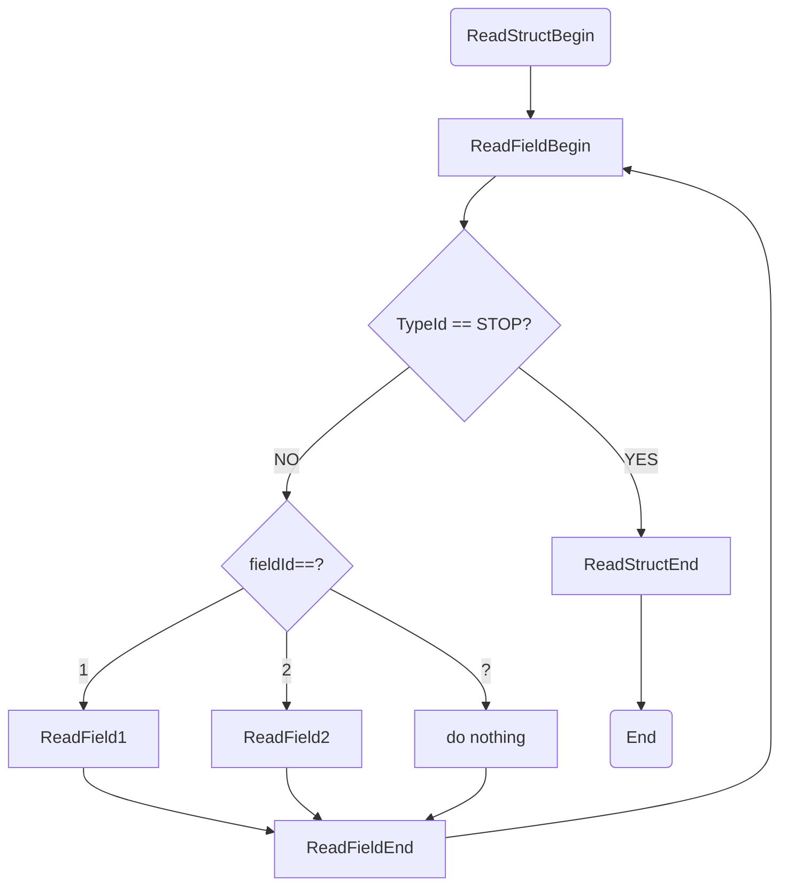
上面是Read函数的流程图，和Write函数是相对的，它首先会ReadStructBegin，之后是ReadFieldBegin，然后根据读到的fieldId来决定接下来应该读的是哪一个字段，接着调用该field的读函数，同样是和该field写函数相对应的。

```golang
func (p *RequestMeta) ReadField1(iprot thrift.TProtocol) error {
	if v, err := iprot.ReadString(); err != nil {
		return fmt.Errorf("error reading field 1: %s", err)
	} else {
		p.Caller = v
	}
	return nil
}
```
上面是protocol层做的事，即把idl定义的结构以何种形式、顺序发送出去，由于这部分代码是自动生成的，服务端的代码和客户端的代码是相对应的，这就是说双方约定好了格式。

接着我们具体来看，客户端是如何调用服务器端实现的函数。

在gcs.go文件中，定义了一个GCSClient。Transport代表一个连接，可以对其进行读写操作，而TProtocol则表示服务端和客户端双方交流使用的格式。
```golang
type GCSClient struct {
	Transport       thrift.TTransport
	ProtocolFactory thrift.TProtocolFactory
	InputProtocol   thrift.TProtocol
	OutputProtocol  thrift.TProtocol
	SeqId           int32
}
```
客户端代码在new了一个GCSClient后，直接调用函数，
```golang
resp, err = client.Coord2Gid(meta, NewCoord2GidReq())
```
内部是这样的：
```golang
func (p *GCSClient) Coord2Gid(meta *RequestMeta, req *Coord2GidReq) (r *Coord2GidResp, err error) {
	if err = p.sendCoord2Gid(meta, req); err != nil {
		return
	}
	return p.recvCoord2Gid()
}
```
首先把两个参数发送出去，接着接收返回的结果。具体看下发送和接收的过程。
```golang
func (p *GCSClient) sendCoord2Gid(meta *RequestMeta, req *Coord2GidReq) (err error) {
	oprot := p.OutputProtocol
	if oprot == nil {
		oprot = p.ProtocolFactory.GetProtocol(p.Transport)
		p.OutputProtocol = oprot
	}
	p.SeqId++
	if err = oprot.WriteMessageBegin("Coord2Gid", thrift.CALL, p.SeqId); err != nil {
		return
	}
	args := Coord2GidArgs{
		Meta: meta,
		Req:  req,
	}
	if err = args.Write(oprot); err != nil {
		return
	}
	if err = oprot.WriteMessageEnd(); err != nil {
		return
	}
	return oprot.Flush()
}
```

```mermaid
graph LR
p.OutputProtocol=oprot-->p.SeqId++
p.SeqId++-->oprot.WriteMessageBegin
oprot.WriteMessageBegin-->A[将所有参数组合成一个结构体Coord2GidArgs]
A-->B[args.Write-oprot-]
B-->oprot.WriteMessageEnd
oprot.WriteMessageEnd-->oprot.Flush
```
```golang
func (p *Coord2GidArgs) Write(oprot thrift.TProtocol) error {
	if err := oprot.WriteStructBegin("Coord2Gid_args"); err != nil {
		return fmt.Errorf("%T write struct begin error: %s", p, err)
	}
	if err := p.writeField1(oprot); err != nil {
		return err
	}
	if err := p.writeField2(oprot); err != nil {
		return err
	}
	if err := oprot.WriteFieldStop(); err != nil {
		return fmt.Errorf("write field stop error: %s", err)
	}
	if err := oprot.WriteStructEnd(); err != nil {
		return fmt.Errorf("write struct stop error: %s", err)
	}
	return nil
}

func (p *Coord2GidArgs) writeField1(oprot thrift.TProtocol) (err error) {
	if err := oprot.WriteFieldBegin("meta", thrift.STRUCT, 1); err != nil {
		return fmt.Errorf("%T write field begin error 1:meta: %s", p, err)
	}
	if err := p.Meta.Write(oprot); err != nil {
		return fmt.Errorf("%T error writing struct: %s", p.Meta, err)
	}
	if err := oprot.WriteFieldEnd(); err != nil {
		return fmt.Errorf("%T write field end error 1:meta: %s", p, err)
	}
	return err
}

func (p *Coord2GidArgs) writeField2(oprot thrift.TProtocol) (err error) {
	if err := oprot.WriteFieldBegin("req", thrift.STRUCT, 2); err != nil {
		return fmt.Errorf("%T write field begin error 2:req: %s", p, err)
	}
	if err := p.Req.Write(oprot); err != nil {
		return fmt.Errorf("%T error writing struct: %s", p.Req, err)
	}
	if err := oprot.WriteFieldEnd(); err != nil {
		return fmt.Errorf("%T write field end error 2:req: %s", p, err)
	}
	return err
}
```
这里的Write函数写的是一个结构体，调用顺序和之前的写函数一致，都是先WriteStructBegin，接着writeField1， writeField2；然后WriteFieldStop，最后WriteStructEnd。而这里的Field1和Field2则是之前已经实现过的函数。

读函数则类似。不再赘述。

Coord2Grid函数在sendCoord2Grid之后，将参数发送给了服务端，服务端调用本地的处理函数处理完之后，将结果发送给客户端，客户端直接调用p.recvCoord2Grid()函数接收结果。

```golang
func (p *GCSClient) recvCoord2Grid() (value *Coord2GridResp, err error) {
	iprot := p.InputProtocol
	if iprot == nil {
		iprot = p.ProtocolFactory.GetProtocol(p.Transport)
		p.InputProtocol = iprot
	}
	_, mTypeId, seqId, err := iprot.ReadMessageBegin()
	if err != nil {
		return
	}
	if mTypeId == thrift.EXCEPTION {
		error53 := thrift.NewTApplicationException(thrift.UNKNOWN_APPLICATION_EXCEPTION, "Unknown Exception")
		var error54 error
		error54, err = error53.Read(iprot)
		if err != nil {
			return
		}
		if err = iprot.ReadMessageEnd(); err != nil {
			return
		}
		err = error54
		return
	}
	if p.SeqId != seqId {
		err = thrift.NewTApplicationException(thrift.BAD_SEQUENCE_ID, "Coord2Grid failed: out of sequence response")
		return
	}
	result := Coord2GridResult{}
	if err = result.Read(iprot); err != nil {
		return
	}
	if err = iprot.ReadMessageEnd(); err != nil {
		return
	}
	value = result.GetSuccess()
	return
}
```

```mermaid
graph LR
p.InputProtocol=iprot-->iprot.ReadMessageBegin
iprot.ReadMessageBegin-->result.Read
result.Read-->iprot.ReadMessageEnd
iprot.ReadMessageEnd-->result.GetSuccess
```
函数iprot.ReadMessageBegin会得到seqId,客户端会检验此seqId是否和自己发送参数时的一致，若一致则会读结果。

```golang
type Gid2CoordResult struct {
	Success *Gid2CoordResp `thrift:"success,0" json:"success"`
}

func NewGid2CoordResult() *Gid2CoordResult {
	return &Gid2CoordResult{}
}

var Gid2CoordResult_Success_DEFAULT *Gid2CoordResp

func (p *Gid2CoordResult) GetSuccess() *Gid2CoordResp {
	if !p.IsSetSuccess() {
		return Gid2CoordResult_Success_DEFAULT
	}
	return p.Success
}
func (p *Gid2CoordResult) IsSetSuccess() bool {
	return p.Success != nil
}

func (p *Gid2CoordResult) Read(iprot thrift.TProtocol) error {
	if _, err := iprot.ReadStructBegin(); err != nil {
		return fmt.Errorf("%T read error: %s", p, err)
	}
	for {
		_, fieldTypeId, fieldId, err := iprot.ReadFieldBegin()
		if err != nil {
			return fmt.Errorf("%T field %d read error: %s", p, fieldId, err)
		}
		if fieldTypeId == thrift.STOP {
			break
		}
		switch fieldId {
		case 0:
			if err := p.ReadField0(iprot); err != nil {
				return err
			}
		default:
			if err := iprot.Skip(fieldTypeId); err != nil {
				return err
			}
		}
		if err := iprot.ReadFieldEnd(); err != nil {
			return err
		}
	}
	if err := iprot.ReadStructEnd(); err != nil {
		return fmt.Errorf("%T read struct end error: %s", p, err)
	}
	return nil
}

func (p *Gid2CoordResult) ReadField0(iprot thrift.TProtocol) error {
	p.Success = &Gid2CoordResp{}
	if err := p.Success.Read(iprot); err != nil {
		return fmt.Errorf("%T error reading struct: %s", p.Success, err)
	}
	return nil
}
```
读结果和读参数的套路一致。至此，客户端完整的一套发送参数，读取结果的流程都已经清楚了。

---
接下来我们需要看下OutputProtocol和InputProtocol到底是怎以将我们的数据进行发送和接收的。

由于引擎内部一般都使用TBinaryProtocol，所以我们来看它的源码。在这之前，我们先看一下TProtocol，它是一个interface。

protocol.go
```golang
type TProtocol interface {
	WriteMessageBegin(name string, typeId TMessageType, seqid int32) error
	WriteMessageEnd() error
	WriteStructBegin(name string) error
	WriteStructEnd() error
	WriteFieldBegin(name string, typeId TType, id int16) error
	WriteFieldEnd() error
	WriteFieldStop() error
	WriteMapBegin(keyType TType, valueType TType, size int) error
	WriteMapEnd() error
	WriteListBegin(elemType TType, size int) error
	WriteListEnd() error
	WriteSetBegin(elemType TType, size int) error
	WriteSetEnd() error
	WriteBool(value bool) error
	WriteByte(value int8) error
	WriteI16(value int16) error
	WriteI32(value int32) error
	WriteI64(value int64) error
	WriteDouble(value float64) error
	WriteString(value string) error
	WriteBinary(value []byte) error

	ReadMessageBegin() (name string, typeId TMessageType, seqid int32, err error)
	ReadMessageEnd() error
	ReadStructBegin() (name string, err error)
	ReadStructEnd() error
	ReadFieldBegin() (name string, typeId TType, id int16, err error)
	ReadFieldEnd() error
	ReadMapBegin() (keyType TType, valueType TType, size int, err error)
	ReadMapEnd() error
	ReadListBegin() (elemType TType, size int, err error)
	ReadListEnd() error
	ReadSetBegin() (elemType TType, size int, err error)
	ReadSetEnd() error
	ReadBool() (value bool, err error)
	ReadByte() (value int8, err error)
	ReadI16() (value int16, err error)
	ReadI32() (value int32, err error)
	ReadI64() (value int64, err error)
	ReadDouble() (value float64, err error)
	ReadString() (value string, err error)
	ReadBinary() (value []byte, err error)

	Skip(fieldType TType) (err error)
	Flush() (err error)

	Transport() TTransport
}
```
看这些Write, Read函数我们会觉得非常熟悉，因为他们就是在前面出现过很多次的，将我们定义的结构体通过这些函数发送出去的。

除了这些Write, Read函数，我们还看到了


    Skip(fieldType TType) (err error)
    Flush() (err error)
    Transport() TTransport

Flush很好理解，Skip也很好理解，代码后面还给出一个默认的实现。

```golang
// The maximum recursive depth the skip() function will traverse
const DEFAULT_RECURSION_DEPTH = 64

// Skips over the next data element from the provided input TProtocol object.
func SkipDefaultDepth(prot TProtocol, typeId TType) (err error) {
	return Skip(prot, typeId, DEFAULT_RECURSION_DEPTH)
}

// Skips over the next data element from the provided input TProtocol object.
func Skip(self TProtocol, fieldType TType, maxDepth int) (err error) {

	if maxDepth <= 0 {
		return NewTProtocolExceptionWithType(DEPTH_LIMIT, errors.New("Depth limit exceeded"))
	}

	switch fieldType {
	case STOP:
		return
	case BOOL:
		_, err = self.ReadBool()
		return
	case BYTE:
		_, err = self.ReadByte()
		return
	case I16:
		_, err = self.ReadI16()
		return
	case I32:
		_, err = self.ReadI32()
		return
	case I64:
		_, err = self.ReadI64()
		return
	case DOUBLE:
		_, err = self.ReadDouble()
		return
	case STRING:
		_, err = self.ReadString()
		return
	case STRUCT:
		if _, err = self.ReadStructBegin(); err != nil {
			return err
		}
		for {
			_, typeId, _, _ := self.ReadFieldBegin()
			if typeId == STOP {
				break
			}
			err := Skip(self, typeId, maxDepth-1)
			if err != nil {
				return err
			}
			self.ReadFieldEnd()
		}
		return self.ReadStructEnd()
	case MAP:
		keyType, valueType, size, err := self.ReadMapBegin()
		if err != nil {
			return err
		}
		for i := 0; i < size; i++ {
			err := Skip(self, keyType, maxDepth-1)
			if err != nil {
				return err
			}
			self.Skip(valueType)
		}
		return self.ReadMapEnd()
	case SET:
		elemType, size, err := self.ReadSetBegin()
		if err != nil {
			return err
		}
		for i := 0; i < size; i++ {
			err := Skip(self, elemType, maxDepth-1)
			if err != nil {
				return err
			}
		}
		return self.ReadSetEnd()
	case LIST:
		elemType, size, err := self.ReadListBegin()
		if err != nil {
			return err
		}
		for i := 0; i < size; i++ {
			err := Skip(self, elemType, maxDepth-1)
			if err != nil {
				return err
			}
		}
		return self.ReadListEnd()
	}
	return nil
}
```
上面还规定了最大的递归深度。因为在遇到Struct, Map, List, Set这些类型时，会递归地调用自身。

再来看

    Transport() TTransport
这里是整个thrift协议的下一层，在TBinaryProtocol的实现中可以看到这一层的Write, Read函数实际上是把内容都写到这一层了。

我们来正式看一下binary_protocol.go的实现。
```golang
type TBinaryProtocol struct {
	trans         TRichTransport
	origTransport TTransport
	reader        io.Reader
	writer        io.Writer
	strictRead    bool
	strictWrite   bool
	buffer        [64]byte
}
```

它将要实现protcol接口定义的所有函数。

这里定义了一个工厂类：
```golang
type TBinaryProtocolFactory struct {
	strictRead  bool
	strictWrite bool
}

func NewTBinaryProtocolFactoryDefault() *TBinaryProtocolFactory {
	return NewTBinaryProtocolFactory(false, true)
}

func NewTBinaryProtocolFactory(strictRead, strictWrite bool) *TBinaryProtocolFactory {
	return &TBinaryProtocolFactory{strictRead: strictRead, strictWrite: strictWrite}
}

func (p *TBinaryProtocolFactory) GetProtocol(t TTransport) TProtocol {
	return NewTBinaryProtocol(t, p.strictRead, p.strictWrite)
}
```
工厂类保存了strictRead和strictWrite，默认的工厂类是严格写非严格读。

而工厂的生产方法是将输入的TTransport加工成TBinaryProtocol。

```golang
func NewTBinaryProtocol(t TTransport, strictRead, strictWrite bool) *TBinaryProtocol {
	p := &TBinaryProtocol{origTransport: t, strictRead: strictRead, strictWrite: strictWrite}
	if et, ok := t.(TRichTransport); ok {
		p.trans = et
	} else {
		p.trans = NewTRichTransport(t)
	}
	p.reader = p.trans
	p.writer = p.trans
	return p
}
```
这里将输入的TTransport首先变成TRichTransport，变且将TRichTransport分别赋给reader和writer。

首先来看WriteMessage相关
```golang
func (p *TBinaryProtocol) WriteMessageBegin(name string, typeId TMessageType, seqId int32) error {
	if p.strictWrite {
		version := uint32(VERSION_1) | uint32(typeId)
		e := p.WriteI32(int32(version))
		if e != nil {
			return e
		}
		e = p.WriteString(name)
		if e != nil {
			return e
		}
		e = p.WriteI32(seqId)
		return e
	} else {
		e := p.WriteString(name)
		if e != nil {
			return e
		}
		e = p.WriteByte(int8(typeId))
		if e != nil {
			return e
		}
		e = p.WriteI32(seqId)
		return e
	}
	return nil
}

func (p *TBinaryProtocol) WriteMessageEnd() error {
	return nil
}
```
WriteMessageBegin的调用层级图：

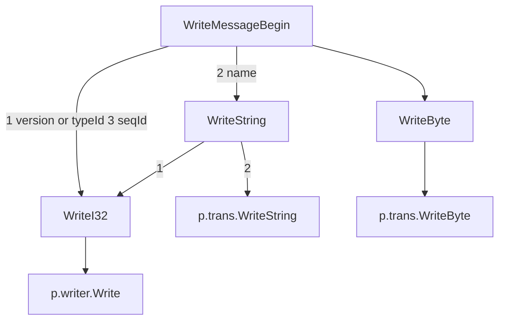
而WriteMessageEnd则什么也不做。

接着，WriteStructBegin，WriteStructEnd也是什么都不做。

继续，
```golang
func (p *TBinaryProtocol) WriteFieldBegin(name string, typeId TType, id int16) error {
	e := p.WriteByte(int8(typeId))
	if e != nil {
		return e
	}
	e = p.WriteI16(id)
	return e
}

func (p *TBinaryProtocol) WriteFieldEnd() error {
	return nil
}
```
```
graph TD
WriteFieldBegin-->|1 typeId|WriteByte
WriteFieldBegin-->|2 id|WriteI16

WriteByte-->p.trans.WriteByte
```

WriteFieldEnd什么也不做。

```golang
func (p *TBinaryProtocol) WriteFieldStop() error {
	e := p.WriteByte(STOP)
	return e
}
```
```
graph TD
WriteFieldStop-->|STOP|WriteByte
WriteByte-->trans.WriteByte
```
```golang
func (p *TBinaryProtocol) WriteMapBegin(keyType TType, valueType TType, size int) error {
	e := p.WriteByte(int8(keyType))
	if e != nil {
		return e
	}
	e = p.WriteByte(int8(valueType))
	if e != nil {
		return e
	}
	e = p.WriteI32(int32(size))
	return e
}

func (p *TBinaryProtocol) WriteMapEnd() error {
	return nil
}
```

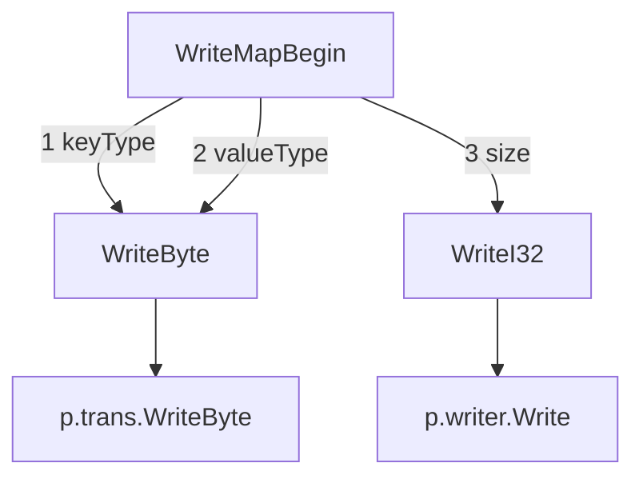
WriteMapEnd什么也不做。

WriteListBegin，WriteSetBegin先写入一个Byte的elemType，再写入I32的size。

WriteListEnd，WriteSetEnd什么也不做。

下面对bool, byte, I16, I32, I64, Double, String的写详细介绍。

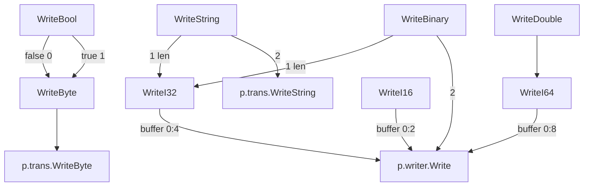
从上图可以看到，写bool, byte, I16, I32, I64, Double这几种基本类型的数据最后都是调用transport.WriteBytetransport.WriteString, writer.Write。而我们知道writer也是由transport得到的。所有说这些操作都会由transport完成。

看完了写，我们再来看读。

```go
func (p *TBinaryProtocol) ReadMessageBegin() (name string, typeId TMessageType, seqId int32, err error) {
	size, e := p.ReadI32()
	if e != nil {
		return "", typeId, 0, NewTProtocolException(e)
	}
	if size < 0 {
		typeId = TMessageType(size & 0x0ff)
		version := int64(int64(size) & VERSION_MASK)
		if version != VERSION_1 {
			return name, typeId, seqId, NewTProtocolExceptionWithType(BAD_VERSION, fmt.Errorf("Bad version in ReadMessageBegin"))
		}
		name, e = p.ReadString()
		if e != nil {
			return name, typeId, seqId, NewTProtocolException(e)
		}
		seqId, e = p.ReadI32()
		if e != nil {
			return name, typeId, seqId, NewTProtocolException(e)
		}
		return name, typeId, seqId, nil
	}
	if p.strictRead {
		return name, typeId, seqId, NewTProtocolExceptionWithType(BAD_VERSION, fmt.Errorf("Missing version in ReadMessageBegin"))
	}
	name, e2 := p.readStringBody(size)
	if e2 != nil {
		return name, typeId, seqId, e2
	}
	b, e3 := p.ReadByte()
	if e3 != nil {
		return name, typeId, seqId, e3
	}
	typeId = TMessageType(b)
	seqId, e4 := p.ReadI32()
	if e4 != nil {
		return name, typeId, seqId, e4
	}
	return name, typeId, seqId, nil
}

```

先读了一个Int32，我们知道写的时候，这个Int32是VERSION_1和typeId相或的结果。

```go
const (
	VERSION_MASK = 0xffff0000
	VERSION_1    = 0x80010000
)
```


VERSION_1的最高位是1，因此读出来的size小于0。

通过

```go
typeId = TMessageType(size & 0x0ff)
version := int64(int64(size) & VERSION_MASK)
```

取出了version和typeId。然后对其进行版本检验，接着读出name和seqId。

```mermaid
graph TD
ReadMessageBegin-->|1|size=ReadI32
size=ReadI32-->|size & 0x0ff|typeId
size=ReadI32-->|int64 size & VERSION_MASK|version

ReadMessageBegin-->|2|name=ReadString
ReadMessageBegin-->|3|seqId=ReadI32
```

和ReadMessageBegin相对应。

同样地，ReadMessageEnd也是什么都不做。

```go
func (p *TBinaryProtocol) ReadMessageEnd() error {
	return nil
}
```

WriteStructBegin，WriteStructEnd同样也是什么都不做。

```go
func (p *TBinaryProtocol) ReadFieldBegin() (name string, typeId TType, seqId int16, err error) {
	t, err := p.ReadByte()
	typeId = TType(t)
	if err != nil {
		return name, typeId, seqId, err
	}
	if t != STOP {
		seqId, err = p.ReadI16()
	}
	return name, typeId, seqId, err
}

func (p *TBinaryProtocol) ReadFieldEnd() error {
	return nil
}
```

```mermaid
graph TD
ReadFieldBegin-->|1|typeId=ReadByte
ReadFieldBegin-->|2|seqId=ReadI16
```

ReadFieldEnd什么也不做。

```go
func (p *TBinaryProtocol) ReadMapBegin() (kType, vType TType, size int, err error) {
   k, e := p.ReadByte()
   if e != nil {
      err = NewTProtocolException(e)
      return
   }
   kType = TType(k)
   v, e := p.ReadByte()
   if e != nil {
      err = NewTProtocolException(e)
      return
   }
   vType = TType(v)
   size32, e := p.ReadI32()
   if e != nil {
      err = NewTProtocolException(e)
      return
   }
   if size32 < 0 {
      err = invalidDataLength
      return
   }
   size = int(size32)
   return kType, vType, size, nil
}

func (p *TBinaryProtocol) ReadMapEnd() error {
   return nil
}
```

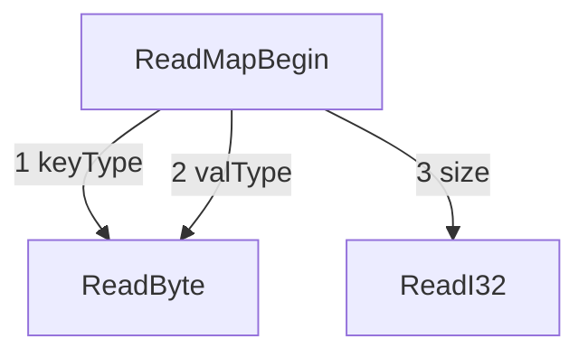

ReadMapEnd什么也不做。

ReadListBegin、ReadListEnd、ReadSetBegin、ReadSetEnd也是同样的套路。

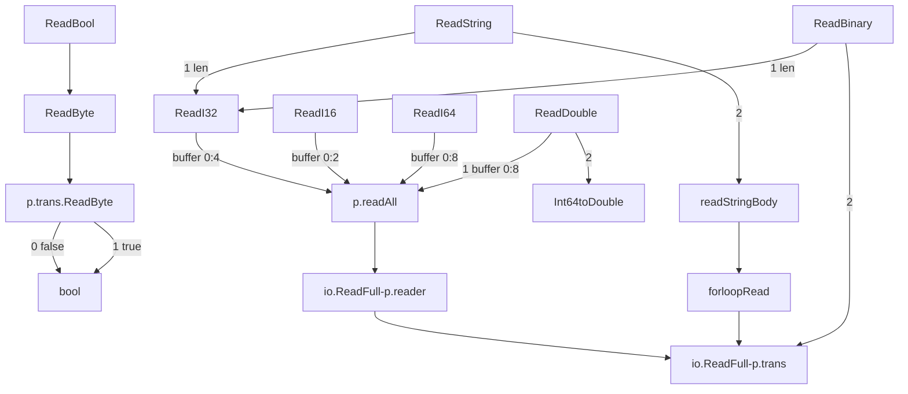

从上图可以看到，关于读这一部分，最终调用的是p.trans提供的方法，p.trans.ReadByte()、以及将transport作为一个reader，调用io.ReadFull方法来读取数据。

```go
func (p *TBinaryProtocol) Flush() (err error) {
	return NewTProtocolException(p.trans.Flush())
}

func (p *TBinaryProtocol) Skip(fieldType TType) (err error) {
	return SkipDefaultDepth(p, fieldType)
}
```

而Flush方法也调用的p.trans.Flush方法，Skip则是调用protocol中定义的方法。

---

上面一部分讲完了TBinaryProtocol，接下来，我们要重点关注TTransport这一层。

```go
type TTransport interface {
	io.ReadWriteCloser
	Flusher
	ReadSizeProvider

	// Opens the transport for communication
	Open() error

	// Returns true if the transport is open
	IsOpen() bool
}

type TRichTransport interface {
	io.ReadWriter
	io.ByteReader
	io.ByteWriter
	stringWriter
	Flusher
	ReadSizeProvider
}

type stringWriter interface {
	WriteString(s string) (n int, err error)
}

type Flusher interface {
	Flush() (err error)
}

type ReadSizeProvider interface {
	RemainingBytes() (num_bytes uint64)
}
```

TRichTransport与TTransport相比，多了io.ByteReader、io.ByteWriter、stringWriter，少了Open() error，IsOpen() bool，还少了closer接口，少的部分，将由其他封装TRichTransport的结构体实现。

TTransport我们使用的是TFramedTransport。

```go
type TFramedTransport struct {
	transport TTransport
	buf       bytes.Buffer
	reader    *bufio.Reader
	frameSize uint32 //Current remaining size of the frame. if ==0 read next frame header
	buffer    [4]byte
	maxLength uint32
}
```

前面说的少的部分实现如下，通过调用更低一层的实现。

```go
func (p *TFramedTransport) Open() error {
	return p.transport.Open()
}

func (p *TFramedTransport) IsOpen() bool {
	return p.transport.IsOpen()
}

func (p *TFramedTransport) Close() error {
	return p.transport.Close()
}
```

而多的部分，

```go
type ByteReader interface {
	ReadByte() (byte, error)
}
type ByteWriter interface {
	WriteByte(c byte) error
}
type stringWriter interface {
	WriteString(s string) (n int, err error)
}
```

也都实现了，

```go
func (p *TFramedTransport) WriteByte(c byte) error {
	return p.buf.WriteByte(c)
}

func (p *TFramedTransport) WriteString(s string) (n int, err error) {
	return p.buf.WriteString(s)
}
func (p *TFramedTransport) ReadByte() (c byte, err error) {
	if p.frameSize == 0 {
		p.frameSize, err = p.readFrameHeader()
		if err != nil {
			return
		}
	}
	if p.frameSize < 1 {
		return 0, NewTTransportExceptionFromError(fmt.Errorf("Not enough frame size %d to read %d bytes", p.frameSize, 1))
	}
	c, err = p.reader.ReadByte()
	if err == nil {
		p.frameSize--
	}
	return
}
```

这些实现覆盖了TTransport的实现。

复习一下，protocol写基本数据类型时，最终调用的TTransport这一层的WriteByte，Write，WriteString方法，读基本数据类型时，最终调用的是TTransport这一层的ReadByte，以及作为Reader接口的Read方法。

Write, Read的实现如下，

```go
func (p *TFramedTransport) Read(buf []byte) (l int, err error) {
	if p.frameSize == 0 {
		p.frameSize, err = p.readFrameHeader()
		if err != nil {
			return
		}
	}
	if p.frameSize < uint32(len(buf)) {
		frameSize := p.frameSize
		tmp := make([]byte, p.frameSize)
		l, err = p.Read(tmp)
		copy(buf, tmp)
		if err == nil {
			err = NewTTransportExceptionFromError(fmt.Errorf("Not enough frame size %d to read %d bytes", frameSize, len(buf)))
			return
		}
	}
	got, err := p.reader.Read(buf)
	p.frameSize = p.frameSize - uint32(got)
	//sanity check
	if p.frameSize < 0 {
		return 0, NewTTransportException(UNKNOWN_TRANSPORT_EXCEPTION, "Negative frame size")
	}
	return got, NewTTransportExceptionFromError(err)
}

func (p *TFramedTransport) Write(buf []byte) (int, error) {
	n, err := p.buf.Write(buf)
	return n, NewTTransportExceptionFromError(err)
}
```

Read函数最大只能读取一帧长度的byte slice。底层调用的是p.reader.Read方法。

因为TTransport这一层也不是最底层，因此着重分析一下，上面提到的读写基本数据类型的方法最终是如何实现的。写的部分：

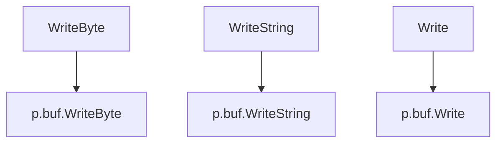

读的部分，

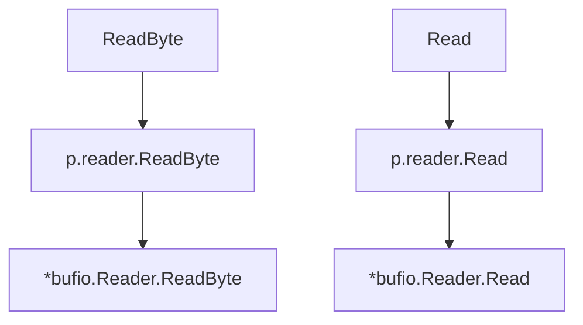

因此TTransport这一层的读写是通过

```go
buf       bytes.Buffer
reader    *bufio.Reader
```

来实现的。

接下来，具体研究下读写的流程。

首先来看写，这就需要研究bytes.Buffer了。

```go
type Buffer struct {
	buf       []byte   // contents are the bytes buf[off : len(buf)]
	off       int      // read at &buf[off], write at &buf[len(buf)]
	bootstrap [64]byte // memory to hold first slice; helps small buffers avoid allocation.
	lastRead  readOp   // last read operation, so that Unread* can work correctly.
}
```

Buffer有一个byte slice，供读写，从off指针处读取，从slice的末尾写，参考off字段的注释。

首先WriteByte函数，

```go
func (b *Buffer) WriteByte(c byte) error {
	b.lastRead = opInvalid
	m := b.grow(1)
	b.buf[m] = c
	return nil
}
```

比较简单，b.grow函数会尝试将buf的长度增加1，然后返回写入的位置 m，然后在m处写入c。

接着来看WriteString和Write，和WriteByte比较类似。

```go
func (b *Buffer) WriteString(s string) (n int, err error) {
	b.lastRead = opInvalid
	m := b.grow(len(s))
	return copy(b.buf[m:], s), nil
}
func (b *Buffer) Write(p []byte) (n int, err error) {
	b.lastRead = opInvalid
	m := b.grow(len(p))
	return copy(b.buf[m:], p), nil
}
```

写完之后，会执行Flush操作，我们来看一下Flush操作：

```go
func (p *TFramedTransport) Flush() error {
	size := p.buf.Len()
	buf := p.buffer[:4]
	binary.BigEndian.PutUint32(buf, uint32(size))
	_, err := p.transport.Write(buf)
	if err != nil {
		return NewTTransportExceptionFromError(err)
	}
	if size > 0 {
		if n, err := p.buf.WriteTo(p.transport); err != nil {
			print("Error while flushing write buffer of size ", size, " to transport, only wrote ", n, " bytes: ", err.Error(), "\n")
			return NewTTransportExceptionFromError(err)
		}
	}
	err = p.transport.Flush()
	return NewTTransportExceptionFromError(err)
}
```


因此，Flush调用的依然是下一层的Write函数和Flush函数。p.buf.WriteTo使用了Write接口。

然后，我们来看读的部分，

```go
func (b *Reader) Read(p []byte) (n int, err error) {
	n = len(p)
	if n == 0 {
		return 0, b.readErr()
	}
	if b.r == b.w {
		if b.err != nil {
			return 0, b.readErr()
		}
		if len(p) >= len(b.buf) {
			// Large read, empty buffer.
			// Read directly into p to avoid copy.
			n, b.err = b.rd.Read(p)
			if n < 0 {
				panic(errNegativeRead)
			}
			if n > 0 {
				b.lastByte = int(p[n-1])
				b.lastRuneSize = -1
			}
			return n, b.readErr()
		}
		// One read.
		// Do not use b.fill, which will loop.
		b.r = 0
		b.w = 0
		n, b.err = b.rd.Read(b.buf)
		if n < 0 {
			panic(errNegativeRead)
		}
		if n == 0 {
			return 0, b.readErr()
		}
		b.w += n
	}

	// copy as much as we can
	n = copy(p, b.buf[b.r:b.w])
	b.r += n
	b.lastByte = int(b.buf[b.r-1])
	b.lastRuneSize = -1
	return n, nil
}

// ReadByte reads and returns a single byte.
// If no byte is available, returns an error.
func (b *Reader) ReadByte() (byte, error) {
	b.lastRuneSize = -1
	for b.r == b.w {
		if b.err != nil {
			return 0, b.readErr()
		}
		b.fill() // buffer is empty
	}
	c := b.buf[b.r]
	b.r++
	b.lastByte = int(c)
	return c, nil
}
```

ReadByte会先判断若b.r == b.w，即读写指针相等，可认为buf里的有效数据为空。因此需要调用fill函数，读取数据。之后返回b.buf[b.r]。

Read函数：

```mermaid
graph TD
start-->C{b.r=?b.w}
C-->|No|E[copy b.buf from b.r-b.w to p]
E-->b.r+=n
C-->|Yes|F[len of p >=? len of b.buf]
F-->|YES|G[b.rd.Read to p]
G-->return

F-->|NO|H[b.rd.Read to b.buf]
H-->|n=readLen|b.w+=n

```


可以看到b.rd.Read最终还是调用了下层的提供的io.Reader接口。

所以还是要重点关注下层的Write函数和Flush函数以及Read函数。


从以上分析，现在的情形是：

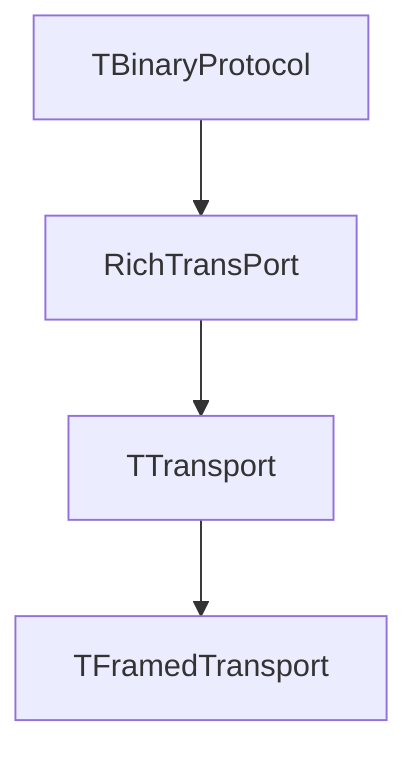

---

在TTransport的下一层就是TSocket。TFramedTransport实现了TRichTransport接口，而TSocket实现了TTransport接口。

```go
type TSocket struct {
	conn    net.Conn
	addr    net.Addr
	timeout time.Duration
}
```

来看一下，我们关注的Read, Write, Flush函数：

```go
func (p *TSocket) Read(buf []byte) (int, error) {
	if !p.IsOpen() {
		return 0, NewTTransportException(NOT_OPEN, "Connection not open")
	}
	p.pushDeadline(true, false)
	n, err := p.conn.Read(buf)
	return n, NewTTransportExceptionFromError(err)
}

func (p *TSocket) Write(buf []byte) (int, error) {
	if !p.IsOpen() {
		return 0, NewTTransportException(NOT_OPEN, "Connection not open")
	}
	p.pushDeadline(false, true)
	return p.conn.Write(buf)
}

func (p *TSocket) Flush() error {
	return nil
}
```

可以看到，最后都是调用的更底层的p.conn.Read(buf)和p.conn.Write(buf)实现。

```go
// Connects the socket, creating a new socket object if necessary.
func (p *TSocket) Open() error {
	if p.IsOpen() {
		return NewTTransportException(ALREADY_OPEN, "Socket already connected.")
	}
	if p.addr == nil {
		return NewTTransportException(NOT_OPEN, "Cannot open nil address.")
	}
	if len(p.addr.Network()) == 0 {
		return NewTTransportException(NOT_OPEN, "Cannot open bad network name.")
	}
	if len(p.addr.String()) == 0 {
		return NewTTransportException(NOT_OPEN, "Cannot open bad address.")
	}
	var err error
	var conn net.Conn
	if conn, err = net.DialTimeout(p.addr.Network(), p.addr.String(), p.timeout); err != nil {
		return NewTTransportException(NOT_OPEN, err.Error())
	}
	p.conn = conn
	return nil
}
```

而更底层的conn是在Open()函数里得到的。我们顺着继续追踪。最后发现是TCPConn:

```go
// TCPConn is an implementation of the Conn interface for TCP network
// connections.
type TCPConn struct {
	conn
}
```

---

现在我们对于protocol和transport层我们大概了解清楚了。我们来看看thrift server怎么启动起来吧。

```go
func (self *ServerInstance) ThriftServer() (svr *thriftipwhitelist.TSimpleServer, err error) {
   var ss *thrift.TServerSocket
   cfg := config.GetMainConfig()
   taddr := self.getThriftListentAddr()
   tf := thrift.NewTFramedTransportFactory(thrift.NewTTransportFactory())
   pf := thrift.NewTBinaryProtocolFactoryDefault()
   ss, err = thrift.NewTServerSocketTimeout(taddr, self.ttimeoutms)
   if err != nil {
      err = fmt.Errorf("NewTServerSocketTimeout err:%s", err.Error())
      return
   }
   processor := gcs.NewGCSProcessor(self)
   svr = thriftipwhitelist.NewTSimpleServer4(processor, ss, tf, pf)
   svr.SetIpAllowhandler(self.allowIp)
   svr.SetBalancer(cfg.Setting.Balancer)
   logger.Info("start gcs thrift server, listen addr:%s", taddr)
   return
}
```

首先定义了一个thrift.TServerSocket。之后分别用NewTFramedTransportFactory，NewTBinaryProtocolFactoryDefault来初化NewTSimpleServer4。

之后，

```go
func (p *TSimpleServer) Serve() error {
	err := p.Listen()
	if err != nil {
		return err
	}
	p.AcceptLoop()
	return nil
}

func (p *TSimpleServer) AcceptLoop() error {
	for {
		client, err := p.serverTransport.Accept()
		if err != nil {
			select {
			case <-p.quit:
				return nil
			default:
			}
			return err
		}
		if client != nil {
			copool.Go(func(arg interface{}) {
				if err := p.processRequests(client); err != nil {
				}
			}, nil)
		}
	}
}
```

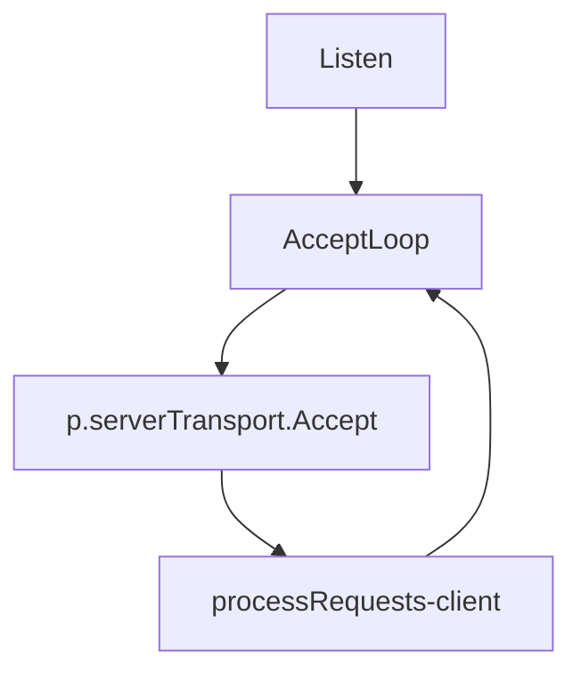

我们看到p.serverTransport.Accept()产生了一个client，这个client代表一个连接。我们知道serverTransport

```go
// Server transport. Object which provides client transports.
type TServerTransport interface {
	Listen() error
	Accept() (TTransport, error)
	Close() error

	// Optional method implementation. This signals to the server transport
	// that it should break out of any accept() or listen() that it is currently
	// blocked on. This method, if implemented, MUST be thread safe, as it may
	// be called from a different thread context than the other TServerTransport
	// methods.
	Interrupt() error
}
```

背后的实现者是

```go
type TServerSocket struct {
	listener      net.Listener
	addr          net.Addr
	clientTimeout time.Duration

	// Protects the interrupted value to make it thread safe.
	mu          sync.RWMutex
	interrupted bool
}
func (p *TServerSocket) Accept() (TTransport, error) {
	p.mu.RLock()
	interrupted := p.interrupted
	p.mu.RUnlock()

	if interrupted {
		return nil, errTransportInterrupted
	}
	if p.listener == nil {
		return nil, NewTTransportException(NOT_OPEN, "No underlying server socket")
	}
	conn, err := p.listener.Accept()
	if err != nil {
		return nil, NewTTransportExceptionFromError(err)
	}
	return NewTSocketFromConnTimeout(conn, p.clientTimeout), nil
}

func NewTSocketFromConnTimeout(conn net.Conn, timeout time.Duration) *TSocket {
	return &TSocket{conn: conn, addr: conn.RemoteAddr(), timeout: timeout}
}
```

Accept函数最后返回了一个TSocket，它实现了TTransport接口，因此之后可以当成TTransport来用。

```go
func (p *TSimpleServer) processRequests(client thrift.TTransport) (err error) {
	var (
		host string
		port string
		line []byte
	)
	if tsocket, ok := client.(*thrift.TSocket); ok {
		if p.balancer == ELB {
			reader := bufio.NewReader(tsocket.Conn())
			line, _, err = reader.ReadLine()
			if err != nil {
				client.Close()
				err = errors.New("EOF")
				return
			}
			fields := strings.Split(string(line), " ")
			if len(fields) < 5 {
				client.Close()
				err = errors.New("Not ELB Request.")
				return
			}
			if fields[0] != "PROXY" {
				client.Close()
				err = errors.New("Not ELB Request.")
				return
			}
			host, port = fields[2], fields[4]
			if fields[2] == fields[3] {
				return
			}
		} else {
			addr := tsocket.Conn().RemoteAddr().String()
			host, port, err = net.SplitHostPort(addr)
			if err != nil {
				client.Close()
				err = errors.New("EOF")
				return
			}
		}
		if p.ipAllowhandler != nil {
			if !p.ipAllowhandler(host, port) {
				client.Close()
				err = errors.New("EOF")
				return
			}
		}
	}

	processor := p.processorFactory.GetProcessor(client)
	inputTransport := p.inputTransportFactory.GetTransport(client)
	outputTransport := p.outputTransportFactory.GetTransport(client)
	inputProtocol := p.inputProtocolFactory.GetProtocol(inputTransport)
	outputProtocol := p.outputProtocolFactory.GetProtocol(outputTransport)
	defer func() {
		if e := recover(); e != nil {
			log.Printf("panic in processor: %s: %s", e, debug.Stack())
		}
	}()
	if inputTransport != nil {
		defer inputTransport.Close()
	}
	if outputTransport != nil {
		defer outputTransport.Close()
	}
	for {
		ok, err := processor.Process(inputProtocol, outputProtocol)
		if err, ok := err.(thrift.TTransportException); ok && err.TypeId() == thrift.END_OF_FILE {
			return nil
		} else if err != nil {
			log.Printf("error processing request: %s", err)
			return err
		}
		if err, ok := err.(thrift.TApplicationException); ok && err.TypeId() == thrift.UNKNOWN_METHOD {
			continue
		}
		if !ok {
			break
		}
	}
	return nil
}
```

这里对原始的Simpleserver进行了hack，把ip和端口取出来了。因此可以进行白名单控制。

```go
type GCSProcessor struct {
	processorMap map[string]thrift.TProcessorFunction
	handler      GCS
}
```

processor := p.processorFactory.GetProcessor(client)。processorFactory把输入的TTransport加工成processor，这里实际上是直接返回的初始化时的processor。thrift.TProcessorFunction是一个接口，定义了Process(seqId int32, in, out TProtocol) (bool, TException)。

而GCS handler呢，需要实现Coord2Gid，也就是服务端真正要做的事：

```go
type GCS interface {
	// Parameters:
	//  - Meta
	//  - Req
	Coord2Gid(meta *RequestMeta, req *Coord2GidReq) (r *Coord2GidResp, err error)
...
}
```

从之前的代码可以看到：

```go
processor := gcs.NewGCSProcessor(self)


processor.Process(inputProtocol, outputProtocol)
```

processor实际上是将ServerInstance传入gcs.NewGCSProcessor之后得到的

```go
func NewGCSProcessor(handler GCS) *GCSProcessor {

	self109 := &GCSProcessor{handler: handler, processorMap: make(map[string]thrift.TProcessorFunction)}
	self109.processorMap["Coord2Gid"] = &gCSProcessorCoord2Gid{handler: handler}
    
	...
    
	return self109
}
```

首先handler GCS要实现Coord2Gid(args.Meta, args.Req)。在p.handler.Coord2Gid(args.Meta, args.Req)处调用。

```go
type gCSProcessorCoord2Gid struct {
	handler GCS
}

func (p *gCSProcessorCoord2Gid) Process(seqId int32, iprot, oprot thrift.TProtocol) (success bool, err thrift.TException) {
	args := Coord2GidArgs{}
	if err = args.Read(iprot); err != nil {
		iprot.ReadMessageEnd()
		x := thrift.NewTApplicationException(thrift.PROTOCOL_ERROR, err.Error())
		oprot.WriteMessageBegin("Coord2Gid", thrift.EXCEPTION, seqId)
		x.Write(oprot)
		oprot.WriteMessageEnd()
		oprot.Flush()
		return false, err
	}

	iprot.ReadMessageEnd()
	result := Coord2GidResult{}
	var retval *Coord2GidResp
	var err2 error
	if retval, err2 = p.handler.Coord2Gid(args.Meta, args.Req); err2 != nil {
		x := thrift.NewTApplicationException(thrift.INTERNAL_ERROR, "Internal error processing Coord2Gid: "+err2.Error())
		oprot.WriteMessageBegin("Coord2Gid", thrift.EXCEPTION, seqId)
		x.Write(oprot)
		oprot.WriteMessageEnd()
		oprot.Flush()
		return true, err2
	} else {
		result.Success = retval
	}
	if err2 = oprot.WriteMessageBegin("Coord2Gid", thrift.REPLY, seqId); err2 != nil {
		err = err2
	}
	if err2 = result.Write(oprot); err == nil && err2 != nil {
		err = err2
	}
	if err2 = oprot.WriteMessageEnd(); err == nil && err2 != nil {
		err = err2
	}
	if err2 = oprot.Flush(); err == nil && err2 != nil {
		err = err2
	}
	if err != nil {
		return
	}
	return true, err
}
```


```go
func (self *ServerInstance) Coord2Gid(meta *gcs.RequestMeta, req *gcs.Coord2GidReq) (*gcs.Coord2GidResp, error) {
	rp, err := routers.Transpond(meta, req, "Coord2Gid")
	if err != nil {
		return nil, err
	}
	resp := rp.(*gcs.Coord2GidResp)
	return resp, err
}
```

有点乱，再总结一下：

在processRequests函数中，for循环中，直接调用：

```go
ok, err := processor.Process(inputProtocol, outputProtocol)
```

直接调用的是processor的函数Process

```go
func (p *GCSProcessor) Process(iprot, oprot thrift.TProtocol) (success bool, err thrift.TException) {
	name, _, seqId, err := iprot.ReadMessageBegin()
	if err != nil {
		return false, err
	}
	if processor, ok := p.GetProcessorFunction(name); ok {
		return processor.Process(seqId, iprot, oprot)
	}
	iprot.Skip(thrift.STRUCT)
	iprot.ReadMessageEnd()
	x110 := thrift.NewTApplicationException(thrift.UNKNOWN_METHOD, "Unknown function "+name)
	oprot.WriteMessageBegin(name, thrift.EXCEPTION, seqId)
	x110.Write(oprot)
	oprot.WriteMessageEnd()
	oprot.Flush()
	return false, x110

}
```

p.GetProcessorFunction通过函数名，从GCSProcessor里拿到对应函数的处理对象，而这个对象里定义了Process(seqId, iprot, oprot)函数，

```go
func (p *gCSProcessorCoord2Gid) Process(seqId int32, iprot, oprot thrift.TProtocol) (success bool, err thrift.TException) {
	args := Coord2GidArgs{}
	if err = args.Read(iprot); err != nil {
		iprot.ReadMessageEnd()
		x := thrift.NewTApplicationException(thrift.PROTOCOL_ERROR, err.Error())
		oprot.WriteMessageBegin("Coord2Gid", thrift.EXCEPTION, seqId)
		x.Write(oprot)
		oprot.WriteMessageEnd()
		oprot.Flush()
		return false, err
	}

	iprot.ReadMessageEnd()
	result := Coord2GidResult{}
	var retval *Coord2GidResp
	var err2 error
	if retval, err2 = p.handler.Coord2Gid(args.Meta, args.Req); err2 != nil {
		x := thrift.NewTApplicationException(thrift.INTERNAL_ERROR, "Internal error processing Coord2Gid: "+err2.Error())
		oprot.WriteMessageBegin("Coord2Gid", thrift.EXCEPTION, seqId)
		x.Write(oprot)
		oprot.WriteMessageEnd()
		oprot.Flush()
		return true, err2
	} else {
		result.Success = retval
	}
	if err2 = oprot.WriteMessageBegin("Coord2Gid", thrift.REPLY, seqId); err2 != nil {
		err = err2
	}
	if err2 = result.Write(oprot); err == nil && err2 != nil {
		err = err2
	}
	if err2 = oprot.WriteMessageEnd(); err == nil && err2 != nil {
		err = err2
	}
	if err2 = oprot.Flush(); err == nil && err2 != nil {
		err = err2
	}
	if err != nil {
		return
	}
	return true, err
}
```

在这个函数里调用会调用ServeInstance里实现的p.handler.Coord2Gid(args.Meta, args.Req)得到处理结果。并写回客户端。而客户端会调用recv函数接收结果。这样，一个完整的远程调用过程就做完了。


