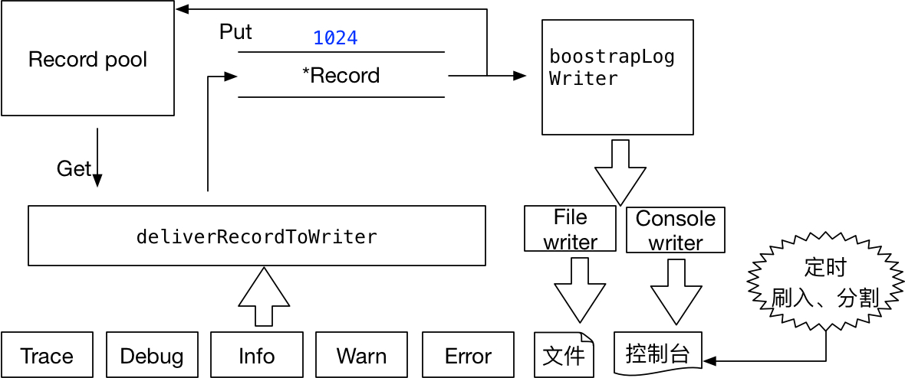

# 系统结构



# 代码学习

## 优雅退出

```go
//close
func (l *Logger) Close() {
	close(l.tunnel)
	<-l.c
}

//boostrapLogWriter
for {
		select {
		case r, ok = <-logger.tunnel:
			if !ok {
				logger.c <- true
				return
			}
        }
  //...
}
```

close函数关闭channel，然后通过取channel挂起线程，等待boostrapLogWriter函数处理完channel里的所有记录，然后向channel里发送true，唤醒close函数。

## 多个writer

```go
type Writer interface {
	Init() error
	Write(*Record) error
}

type Rotater interface {
	Rotate() error
	SetPathPattern(string) error
}

type Flusher interface {
	Flush() error
}
```

file_writer实现了所有的接口，可写、可刷入、可切分文件。

console_writer仅实现Writer接口。

## select语句

```Go
//boostrapLogWriter
flushTimer := time.NewTimer(time.Millisecond * 500)
rotateTimer := time.NewTimer(time.Second * 10)

for {
	select {
	case r, ok = <-logger.tunnel:
		if !ok {
			logger.c <- true
			return
		}

		for _, w := range logger.writers {
			if err := w.Write(r); err != nil {
				log.Println(err)
			}
		}

		recordPool.Put(r)

	case <-flushTimer.C:
		for _, w := range logger.writers {
			if f, ok := w.(Flusher); ok {
				if err := f.Flush(); err != nil {
					log.Println(err)
				}
			}
		}
		flushTimer.Reset(time.Millisecond * 1000)

	case <-rotateTimer.C:
		for _, w := range logger.writers {
			if r, ok := w.(Rotater); ok {
				if err := r.Rotate(); err != nil {
					log.Println(err)
				}
			}
		}
		rotateTimer.Reset(time.Second * 10)
	}
}
```

通过select语句来定时执行刷入、分割文件的任务。

## 对象池

通过对象池来减少垃圾回收的东西。

# 不足

```go
for _, w := range l.writers {
	if f, ok := w.(Flusher); ok {
		if err := f.Flush(); err != nil {
			log.Println(err)
		}
	}
}
```

有些函数可以复用，可以提炼出来。

有些命名不太好。如tmp等。